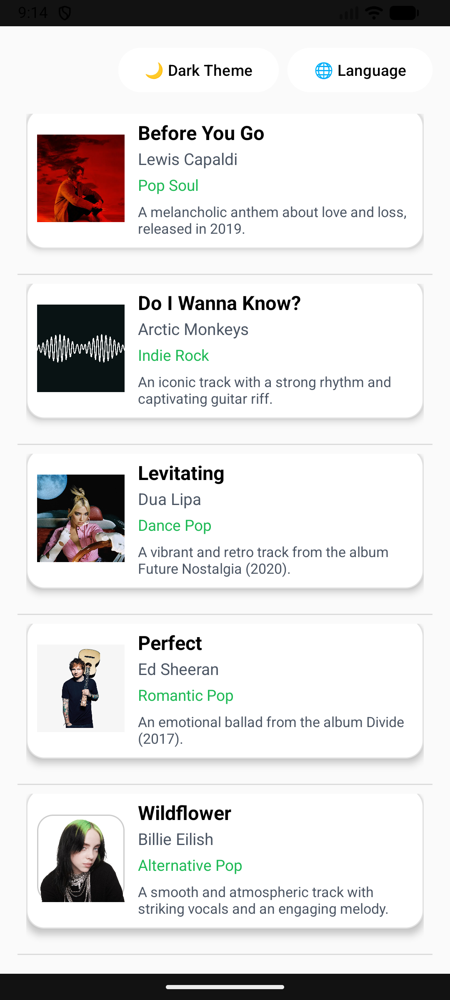
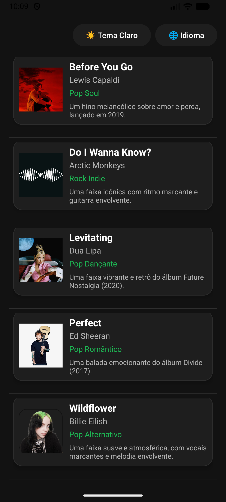
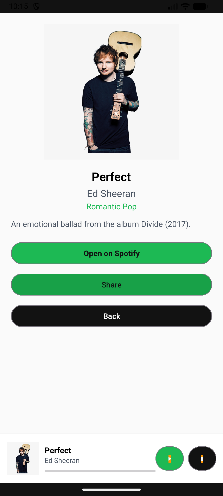
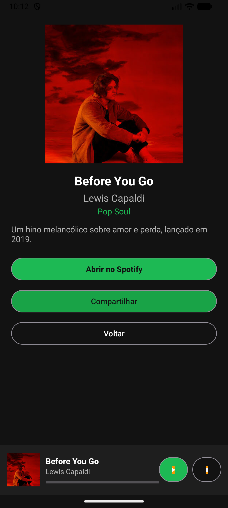

# 🎵 Guia Rocket

Aplicativo Android desenvolvido em **Kotlin**, inspirado no Spotify, que exibe uma lista de músicas e permite visualizar detalhes, ouvir prévias e compartilhar informações com outros aplicativos.

---

## 📱 Sobre o Projeto

O **Guia Rocket** é um app criado para a disciplina de Desenvolvimento de Aplicativos Móveis.  
Ele apresenta uma lista de músicas e, ao clicar em uma delas, abre uma nova tela com mais detalhes e um mini player funcional.

O projeto utiliza **View Binding**, **Material Design 3**, e **Intents** (explícitas e implícitas) para navegação e compartilhamento.

---

## 🚀 Funcionalidades

- 📋 Lista de músicas com imagem, nome e artista  
- 🧭 Abertura de tela de detalhes via **Intent explícita**  
- 🎧 Mini player fixo com botões de **Play**, **Pause** e **Stop**  
- 📤 Compartilhamento da música com outros apps (`ACTION_SEND`)  
- 🌙 Suporte a **modo escuro e claro**  
- 🌐 **Troca de idioma** entre português e inglês  
- 🧩 Interface moderna seguindo o **Material Design**

---

## 🧠 Tecnologias Utilizadas

- **Kotlin**  
- **View Binding**  
- **Material Design 3**  
- **Intents (explícitas e implícitas)**  
- **MediaPlayer**  
- **Internacionalização (pt-BR / en)**

---

## 🎨 Capturas de Tela (Esquerdo Inglês | Direito Português)

<h3 align="center">Catalogo de Música</h3>

<div align="center">
  
  
</div>

<br><br>

<h3 align="center">Dados da Música</h3>

<div align="center">
  
  
</div>
<br>

---

## 🎬 Demonstração em Vídeo

🎥 **Assista à demonstração do app:**  
👉 [Clique aqui para ver o vídeo no YouTube](https://youtube.com/shorts/1BmojnYTTHY?feature=share)

---

## ⚙️ Como Executar

1. Clone o repositório:  
   ```bash
   git clone https://github.com/seuusuario/GuiaRocket.git
2. Abra o projeto no Android Studio

3. Baixe as dependências (Gradle Sync)

4. Conecte um emulador ou dispositivo Android

5. Clique em Run ▶️ para iniciar o app

👨‍💻 Autor
Tiago Setti Mendes
Desenvolvimento de Aplicativos Móveis — 2025
